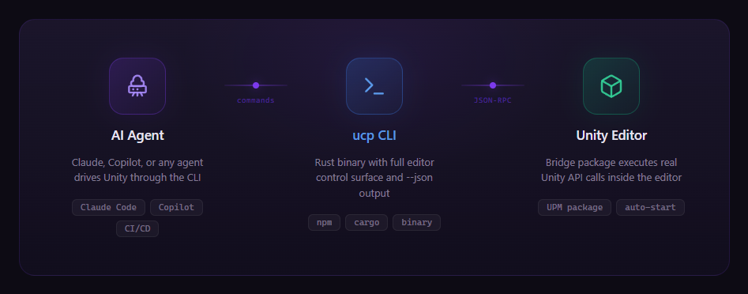
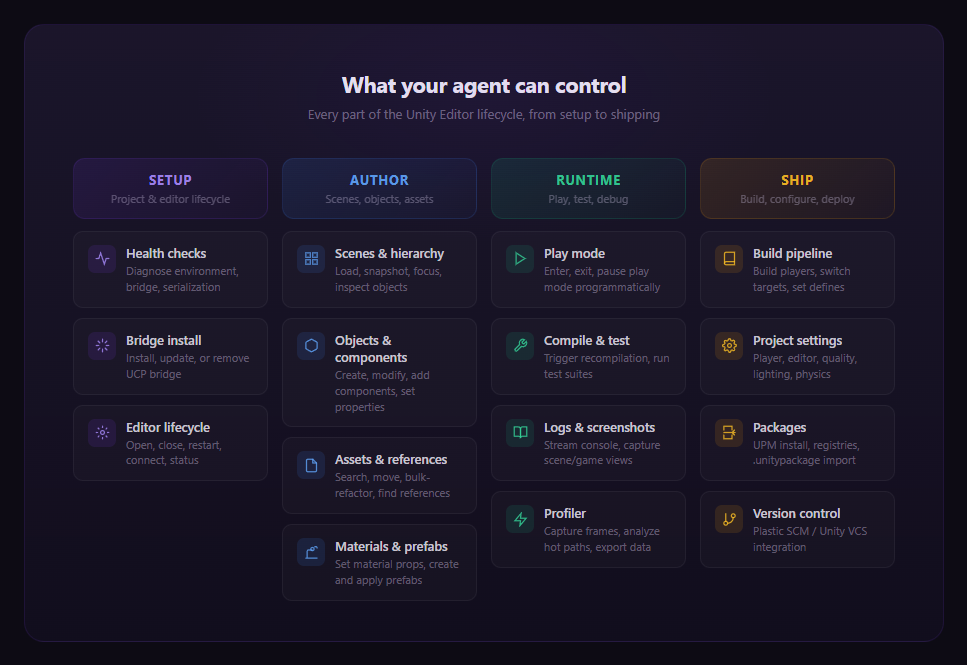

<p align="center">
  
</p>

<h1 align="center">Unity Control Protocol</h1>

<p align="center">
  <strong>Give your AI agent full control of the Unity Editor.</strong><br>
  Scenes, objects, assets, builds, tests, profiling — everything, from the terminal.
</p>

<p align="center">
  <a href="https://www.npmjs.com/package/@mflrevan/ucp"></a>&nbsp;
  <a href="https://github.com/mflRevan/unity-control-protocol/releases"></a>&nbsp;
  <a href="LICENSE.md"></a>&nbsp;
  <a href="https://discord.gg/F4RjhdVTbz"></a>
</p>

<p align="center">
  <a href="https://unityctl.dev/docs">Documentation</a>&nbsp;&nbsp;·&nbsp;&nbsp;<a href="https://github.com/mflRevan/unity-control-protocol/releases">Releases</a>&nbsp;&nbsp;·&nbsp;&nbsp;<a href="https://discord.gg/F4RjhdVTbz">Discord</a>&nbsp;&nbsp;·&nbsp;&nbsp;<a href="https://www.npmjs.com/package/@mflrevan/ucp">npm</a>
</p>

<br>

## What is UCP

Unity has no CLI. If an agent wants to move assets, run tests, tweak a material, or trigger a build — it can't. The editor is a GUI-only black box.

UCP opens that box. It's a Rust CLI that connects to a bridge package running inside the Unity Editor over localhost WebSocket. Every editor operation becomes a structured command with `--json` output. The agent talks to the CLI, the CLI talks to Unity, and Unity does the work.

No cloud. No accounts. No plugins to configure. Install the bridge, connect, and the agent has the editor.

<p align="center">
  
</p>

<br>

## What the agent gets

The entire Unity Editor lifecycle — from bootstrapping a project to shipping a build — exposed as structured, automatable operations.

<p align="center">
  
</p>

<br>

## What this enables

### Autonomous refactoring

An agent can search every reference to a material, rename and relocate hundreds of assets in a single batch, verify nothing broke, recompile, and run the full test suite — without a human touching the editor. Moves go through Unity's `AssetDatabase`, so GUIDs, `.meta` files, and serialized references stay intact.

### End-to-end feature implementation

Write scripts in the workspace, recompile through the bridge, assemble GameObjects and components in the live scene, persist them as prefabs, capture screenshots for visual verification, and run tests — all in one continuous agent loop. The agent never leaves the terminal.

### Automated testing and CI/CD

Connect to the editor, trigger compilation, run edit-mode or play-mode test suites with structured JSON results, configure scripting defines, build the player, and shut down cleanly. Every step is gated and machine-readable.

### Live profiling and debugging

Start a profiler session, enter play mode, capture frame data, analyze hot paths and hierarchy timings, export structured snapshots — all programmatically. The agent can diagnose performance issues without a human opening the profiler window.

### Visual iteration loops

Snapshot the scene hierarchy to discover objects, focus the scene camera, capture screenshots, modify properties, capture again. The agent gets spatial awareness of the Unity scene and can iterate visually.

<br>

## Install

```bash
npm install -g @mflrevan/ucp
```

<details>
<summary>pnpm / cargo / binary</summary>

```bash
# pnpm
pnpm add -g @mflrevan/ucp && pnpm approve-builds

# From source
git clone https://github.com/mflRevan/unity-control-protocol.git
cd unity-control-protocol/cli && cargo build --release
```

Or download a binary from [GitHub Releases](https://github.com/mflRevan/unity-control-protocol/releases).

</details>

Then in any Unity project:

```bash
ucp install    # add the bridge package
ucp open       # launch Unity and connect
```

> `ucp doctor` validates your setup — Unity resolution, bridge health, and project serialization settings.

<br>

## Agent integration

UCP ships as a [Claude Code](https://docs.anthropic.com/en/docs/claude-code) plugin. The skill file (not limited to Claude Code, can be used in other harnesses too) teaches the agent the full control surface, common workflows, and edge-case handling.

```bash
# Local, only for the duration of the session (https://code.claude.com/docs/en/plugins-reference#plugin-caching-and-file-resolution)
claude --plugin-dir /path/to/unity-control-protocol

# Marketplace, installed for future sessions
/plugin marketplace add mflRevan/unity-control-protocol
/plugin install ucp@unity-control-protocol
```

Every command supports `--json` — agents can always get structured, parseable output.

<br>

## Platform support

| Platform | Architecture             |
| -------- | ------------------------ |
| Windows  | x64                      |
| macOS    | x64, ARM (Apple Silicon) |
| Linux    | x64                      |

Unity 2021.3+. Tested across Unity 6 (`6000.0` – `6000.4`).

<br>

## Repository layout

```
cli/                              Rust CLI — the ucp binary
unity-package/com.ucp.bridge/     Unity Editor bridge package
npm/                              npm distribution wrapper
docs/                             Markdown documentation source
website/                          Docs site (unityctl.dev)
skills/                           AI agent skill files
scripts/                          Build, validation, and release helpers
```

## Contributing

See [CONTRIBUTING.md](CONTRIBUTING.md) for development setup, testing, and release workflow.

## License

[MIT](LICENSE.md)
