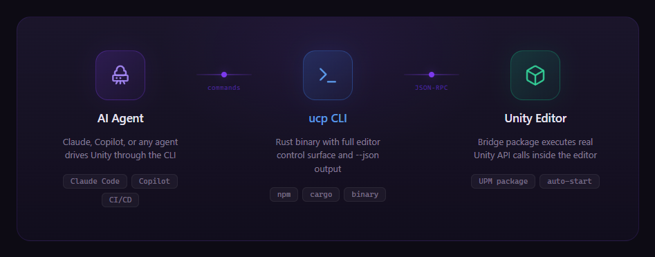
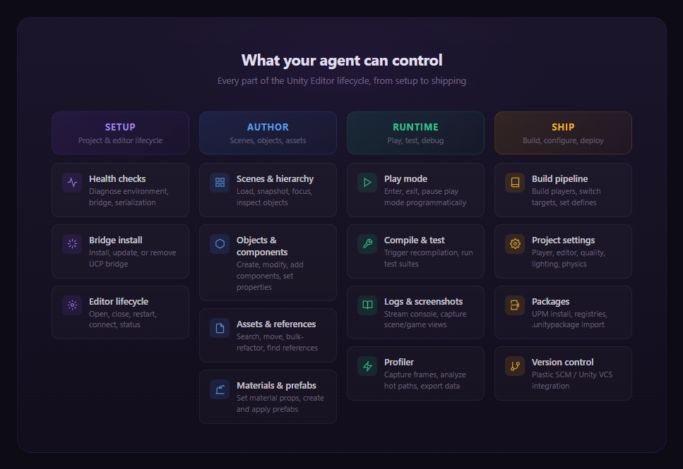

<p align="center">
  
</p>

<h1 align="center">Unity Control Protocol</h1>

<p align="center">
  <strong>Drive the Unity Editor from the terminal.</strong><br>
  Scenes, objects, assets, materials, prefabs, builds, tests, profiling - as structured commands.
</p>

<p align="center">
  <a href="https://www.npmjs.com/package/@mflrevan/ucp"></a>&nbsp;
  <a href="https://github.com/mflRevan/unity-control-protocol/releases"></a>&nbsp;
  <a href="LICENSE.md"></a>&nbsp;
  <a href="https://discord.gg/F4RjhdVTbz"></a>
</p>

<p align="center">
  <a href="https://unityctl.dev/docs">Documentation</a>&nbsp;&nbsp;·&nbsp;&nbsp;<a href="https://github.com/mflRevan/unity-control-protocol/releases">Releases</a>&nbsp;&nbsp;·&nbsp;&nbsp;<a href="https://discord.gg/F4RjhdVTbz">Discord</a>&nbsp;&nbsp;·&nbsp;&nbsp;<a href="https://www.npmjs.com/package/@mflrevan/ucp">npm</a>
</p>

<br>

## What is UCP

`ucp` is a Rust CLI that talks to a bridge package running inside the Unity Editor over a localhost
WebSocket. Editor operations that otherwise require clicking through the GUI become commands with
structured `--json` output, so a script - or an agent - can drive them.

```console
$ ucp scene query 'component=Camera'
$ ucp transform move --name "Main Camera" --to 0 3 -8 --space world
$ ucp view isolate --name Player --views front,right
$ ucp run-tests --mode EditMode --json
```

It runs entirely on your machine: no cloud service, no Unity account, no license activation, and
nothing to sign in to. It attaches to an editor you already have open, or launches one itself.

<p align="center">
  
</p>

<br>

## Why not Unity's own CLI

Unity shipped [its own CLI and `com.unity.pipeline` package](https://docs.unity.com/en-us/unity-cli)
in July 2026, and it is a good foundation - editor installs, licensing, project scaffolding, CI
plumbing, an MCP server, and a generic command catalog. UCP is not a replacement for that. It is the
deep layer, covering surfaces Unity's built-in catalog does not reach:

| | Unity CLI + Pipeline | UCP |
| --- | --- | --- |
| Profiler sessions, frames, hierarchy, timeline, callstacks | planned | yes |
| Frame debugger export | planned | yes |
| Reference graph (`references find` / `index`) | - | yes |
| Asset importer settings | - | yes |
| Materials, shader properties and keywords | - | yes |
| Prefab status / apply / revert / overrides | - | yes |
| Spatial queries (raycast, overlap, bounds, ground) | - | yes |
| Composed capture (isolate, orbit, multi-angle grids) | screenshot | yes |
| Package management, selective `.unitypackage` import | - | yes |
| Unity VCS / Plastic | - | yes |
| Per-operation `Undo` registration | - | yes |
| Reachable while the project has compile errors | no (Safe Mode blocks packages) | yes (`--dialog-policy auto`) |
| Minimum Unity version | 6.0 | 2021.3 |
| Requires a Unity account | yes | no |

The two compose: use Unity's CLI for the editor lifecycle, `ucp` for the work inside it. See
[docs/project/unity-cli-competitive-analysis.md](docs/project/unity-cli-competitive-analysis.md) for
the full comparison.

<br>

## What the agent gets

<p align="center">
  
</p>

A few things that are awkward or impossible without it:

- **Refactor safely at scale.** `asset bulk-move` routes through Unity's `AssetDatabase`, so GUIDs,
  `.meta` files, and serialized references survive; `references find` proves nothing broke.
- **See the scene.** `view isolate` renders one object auto-framed from its bounds as a multi-angle
  composite, so a vision model can read 3D shape from a single image. `spatial raycast` / `bounds` /
  `ground` answer geometric questions that a hierarchy dump cannot.
- **Close the loop.** Edit scripts, `compile` (which exits non-zero and reports the actual `CS####`
  errors), assemble objects in the live scene, save a prefab, capture, run tests - without leaving
  the terminal.
- **Profile programmatically.** Run a session, then read the hierarchy sorted by self time, with
  `--fields` to keep the payload small and truncation reported as "showing 50 of 4,312".

<br>

## Install

```bash
npm install -g @mflrevan/ucp
```

<details>
<summary>pnpm / cargo / binary</summary>

```bash
# pnpm
pnpm add -g @mflrevan/ucp && pnpm approve-builds

# From source
git clone https://github.com/mflRevan/unity-control-protocol.git
cd unity-control-protocol/cli && cargo build --release
```

Or download a binary from [GitHub Releases](https://github.com/mflRevan/unity-control-protocol/releases).

</details>

Then, in any Unity project:

```bash
ucp install    # add the bridge package to Packages/manifest.json
ucp open       # launch Unity and wait for the bridge
ucp doctor     # verify Unity resolution, bridge health, serialization settings
```

<br>

## Agent integration

UCP ships as two [Claude Code](https://docs.anthropic.com/en/docs/claude-code) plugins. The skill
files are plain Markdown and work in other harnesses too.

```bash
/plugin marketplace add mflRevan/unity-control-protocol

/plugin install ucp@unity-control-protocol            # one skill covering the whole surface
/plugin install ucp-surfaces@unity-control-protocol   # 15 focused per-surface skills instead
```

To try it without installing, point Claude Code at a checkout for the session:

```bash
claude --plugin-dir /path/to/unity-control-protocol
```

Every command accepts `--json`. The docs site publishes per-page Markdown mirrors and an
[llms.txt](https://unityctl.dev/llms.txt) for agents that read documentation directly.

<br>

## Platform support

| Platform | Architecture             |
| -------- | ------------------------ |
| Windows  | x64                      |
| macOS    | x64, ARM (Apple Silicon) |
| Linux    | x64                      |

Unity 2021.3+. Tested across Unity 6 (`6000.0` – `6000.4`).

<br>

## Repository layout

```
cli/                              Rust CLI - the ucp binary
unity-package/com.ucp.bridge/     Unity Editor bridge package
npm/                              npm distribution wrapper
docs/                             Markdown documentation source
website/                          Docs site (unityctl.dev)
skills/                           Omni agent skill
plugins/ucp-surfaces/             Generated per-surface micro-skills
scripts/                          Build, validation, and release helpers
```

## Contributing

See [CONTRIBUTING.md](CONTRIBUTING.md) for development setup, testing, and release workflow.

## License

[MIT](LICENSE.md)
